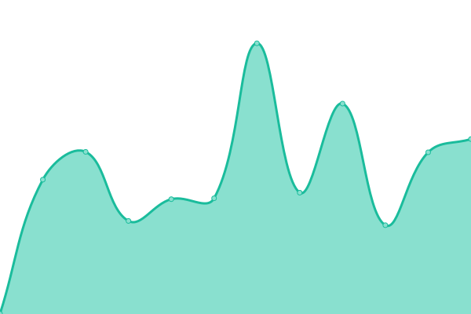

# [📈 Live Status](https://intechstudio.github.io/uptime): <!--live status--> **🟩 All systems operational**

This repository contains the open-source uptime monitor and status page for [Intech Studio](https://intech.studio), powered by [Upptime](https://github.com/upptime/upptime).

With [Upptime](https://upptime.js.org), you can get your own unlimited and free uptime monitor and status page, powered entirely by a GitHub repository. We use [Issues](https://github.com/intechstudio/uptime/issues) as incident reports, [Actions](https://github.com/intechstudio/uptime/actions) as uptime monitors, and [Pages](https://intechstudio.github.io/uptime) for the status page.

<!--start: status pages-->
<!-- This summary is generated by Upptime (https://github.com/upptime/upptime) -->
<!-- Do not edit this manually, your changes will be overwritten -->
<!-- prettier-ignore -->
| URL | Status | History | Response Time | Uptime |
| --- | ------ | ------- | ------------- | ------ |
|  [Intech Studio Website](https://intech.studio/health) | 🟩 Up | [intech-studio-website.yml](https://github.com/intechstudio/uptime/commits/HEAD/history/intech-studio-website.yml) | 

 593ms
     
 | 

<a href="https://intechstudio.github.io/uptime/history/intech-studio-website">97.95%</a>
    

|  [Vendure](https://vendure.intech.studio/health) | 🟩 Up | [vendure.yml](https://github.com/intechstudio/uptime/commits/HEAD/history/vendure.yml) | 

 671ms
     
 | 

<a href="https://intechstudio.github.io/uptime/history/vendure">97.82%</a>
    

|  [HQ-API](https://hq2.intech.studio/health) | 🟩 Up | [hq-api.yml](https://github.com/intechstudio/uptime/commits/HEAD/history/hq-api.yml) | 

 672ms
     
 | 

<a href="https://intechstudio.github.io/uptime/history/hq-api">98.75%</a>
    

|  [Documentation](https://grid-documentation.onrender.com/) | 🟩 Up | [documentation.yml](https://github.com/intechstudio/uptime/commits/HEAD/history/documentation.yml) | 

 200ms
     
 | 

<a href="https://intechstudio.github.io/uptime/history/documentation">100.00%</a>
    

|  [Oracle](https://oracle.intech.studio/healthz) | 🟩 Up | [oracle.yml](https://github.com/intechstudio/uptime/commits/HEAD/history/oracle.yml) | 

 596ms
     
 | 

<a href="https://intechstudio.github.io/uptime/history/oracle">98.48%</a>
    

<!--end: status pages-->

[**Visit our status website →**](https://intechstudio.github.io/uptime)

## 📄 License

- Powered by: [Upptime](https://github.com/upptime/upptime)
- Code: [MIT](./LICENSE) © [Intech Studio](https://intech.studio)
- Data in the `./history` directory: [Open Database License](https://opendatacommons.org/licenses/odbl/1-0/)
